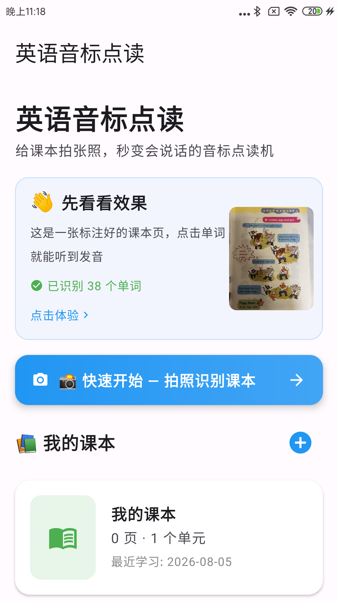
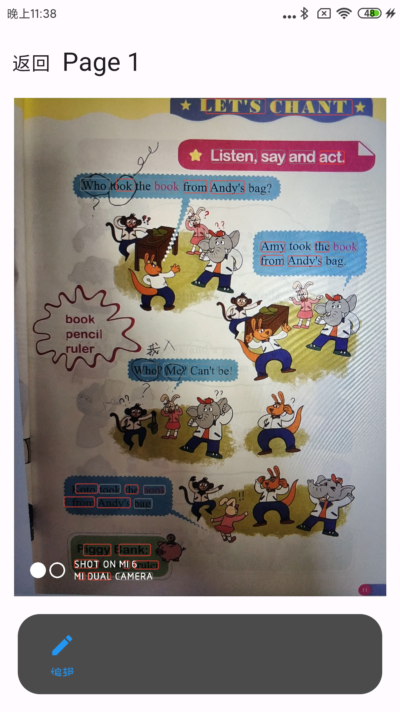
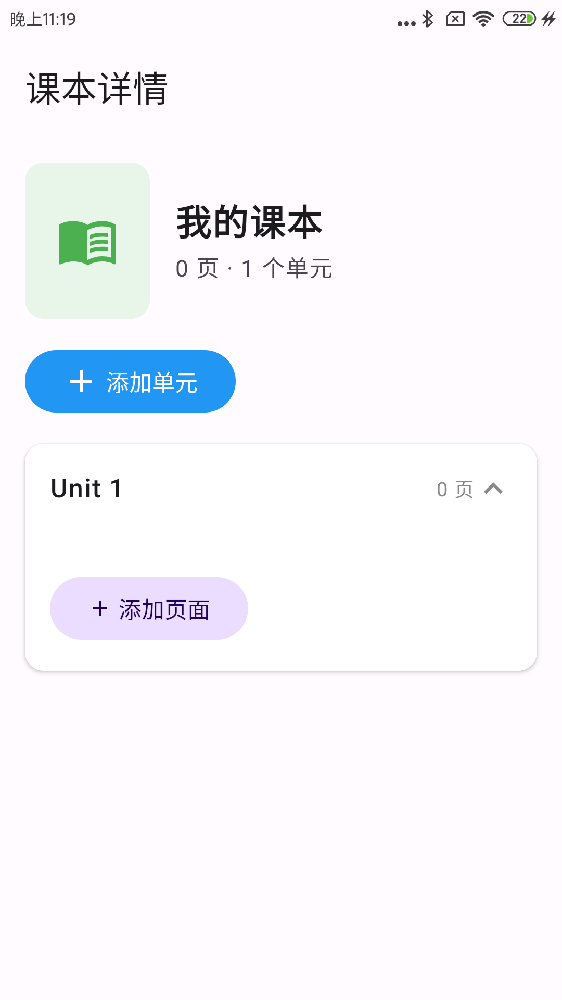
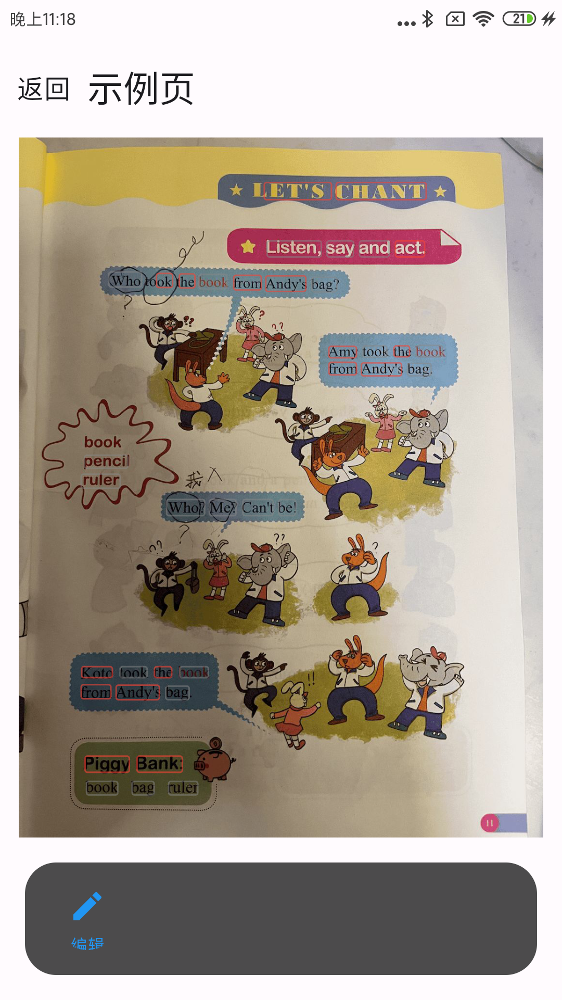
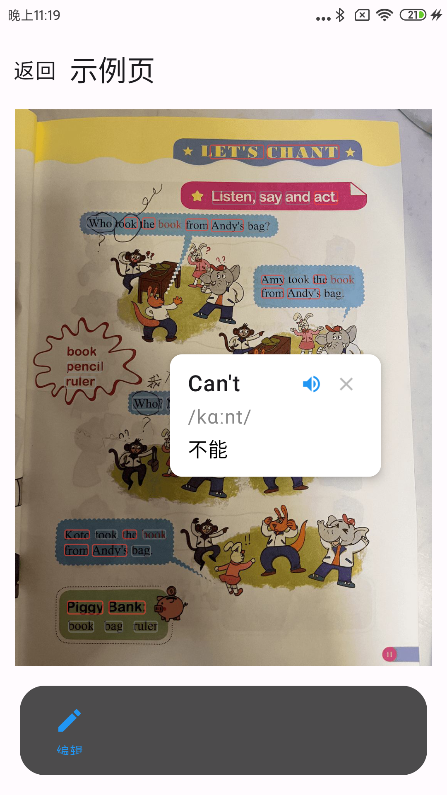
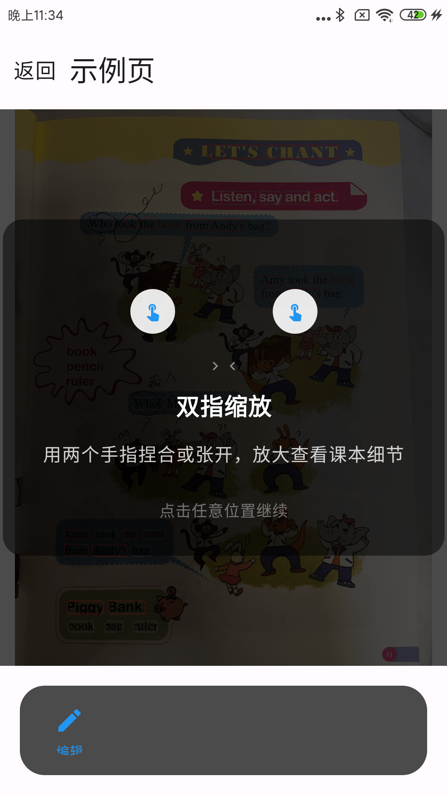

# 课本读软件操作手册

## 一、相关文档

| 文档名称 | 指向资料 | 说明 |
| --- | --- | --- |
| 总体设计 | 《Android_Technical_Document.md》 | 说明软件整体架构、功能模块、页面组成和运行环境。 |
| 详细设计 | 《Android_Development_Summary.md》 | 说明各功能页面、数据模型、识别与发音处理流程。 |
| 测试案例 | 《弹窗相关修改记录.md》 | 记录发音无声、弹窗位置、新手引导等问题的修正场景与预期效果。 |

## 二、软件说明

课本读软件是一款安装在安卓手机或平板上的英语课本点读工具，主要面向小学阶段的学生家长和孩子本人。家长或孩子把孩子的英语课本某一页拿手机拍下来，软件会在这张页面图片上自动找出英文单词，并为每个单词标上音标和中文释义；此后用手指点一下页面上的单词，就能听到这个单词的标准发音。这样一本普通的纸质英语课本，就变成了一台会说话的"音标点读机"。

软件把课本内容按"课本—单元—页面"三层结构来组织。用户既可以建立多本课本（例如人教版三年级上册、四年级下册），也可以在同一本课本里按单元整理页面。课本的页面、识别出的单词标注、以及手动修改过的音标都保存在手机本地，不需要连接网络即可使用全部功能。

本手册面向使用本软件的家长和孩子，介绍软件的用途、功能特点、运行要求，并按照实际页面说明每一步怎么操作、操作后能看到什么结果。使用本软件不需要任何专业知识，按照页面提示操作即可。

## 三、功能特点

软件最大的特点是"拍照即可点读"。用户不需要手工录入单词，只要把课本页面拍下来或从相册选一张图片，软件就会自动完成文字识别、音标标注和位置记录，省去逐个单词抄写的麻烦。

识别完成后，页面上的每个单词都带有一个可点击的区域，也就是"标注框"。点一下标注框，屏幕会在单词旁边弹出一个浮层，浮层里同时显示这个单词、它的音标和中文释义；再点浮层里的喇叭按钮，就可以听到这个单词的英语发音。发音有美式和英式两种选择，方便孩子熟悉不同口音。

为了看清单词的细节，软件支持用两根手指在页面上张开或并拢来放大、缩小页面，放大后还可以按住页面来回拖动查看。如果某次识别的结果不太理想，用户可以进入编辑状态，直接把标注框拖到正确的位置，或者点开标注框修改单词和音标；词库中没有的单词，也可以手动把音标填进去。修改完成后再点一次"重识"，软件还会对整页重新识别一次，帮助获得更准确的结果。

软件还照顾到了新用户和低年级孩子：第一次进入点读页时，屏幕上会自动出现简单明了的引导提示，教用户"点单词听发音"和"双指缩放"，并且引导只在前两次使用时出现，不会打扰日常使用。首页的"快速开始"按钮让用户不必先建课本、再建单元，拍一张照片就能直接进入点读页，看到效果。

## 四、系统要求

| 系统要求 | 最低配置 | 推荐配置 |
| --- | --- | --- |
| 操作系统 | Android 8.0（API 26） | Android 15（API 35）及以上 |
| 运行设备 | 支持相机拍摄或相册选图的安卓手机、平板 | 配置较好的安卓手机或平板 |
| 网络 | 不依赖网络即可使用全部功能 | 不需要联网 |

软件在安卓系统上运行，需要使用手机自带的相机（或系统相册）来导入课本页面图片，并使用系统自带的文字转语音能力来播放单词发音。若设备缺少英语语音包，发音功能会提示到系统设置中下载，详见本手册"常见问题解答"部分。

## 五、首页

首页是打开软件后看到的第一页，也是课本管理的入口。页面上方显示软件名称"英语音标点读"和一句说明"给课本拍张照，秒变会说话的音标点读机"，让用户一眼明白软件是做什么的。往下看，页面上依次排列着"先看看效果"的示例课本卡片、蓝色的"快速开始"按钮，以及"我的课本"列表。

首次使用时，用户还没有添加课本，页面中间会显示"还没有课本"的提示，并提示点击右上角的加号来添加孩子的英语课本。添加课本时，软件会弹出一个输入框，用户输入课本名称（例如"人教版三年级上册"）后点"添加"，课本就会出现在列表里，卡片上会显示这本课本有多少页、多少个单元，以及最近学习日期。点击卡片，就可以进入这本课本的详情页。

页面上方还有一块示例课本的体验卡片，点击它可以直接进入一个已经做好标注的示例页面，感受"点一下单词就发音"的效果；蓝色的"快速开始"按钮则适合想立刻动手的用户，点它之后软件会自动建好课本和单元，接着拍照或选图，识别完成直接进入点读页。

## 六、课本详情页

课本详情页用于查看和管理某一本课本的内容，用户在首页点击课本卡片后进入。页面顶部显示课本名称和"X 页 · X 个单元"的统计，下面有一个"添加单元"按钮，再往下是按单元分组的卡片列表。

每个单元卡片上都写着单元名称和页数，点击卡片标题可以在展开和收起之间切换。单元内以网格形式排列着每一页的缩略图，缩略图下方是页面名称。用户可以在单元内点击"添加页面"按钮，给这个单元增加新的课本页面；也可以直接点击某个页面的缩略图，进入该页面的点读页进行学习。

对每一页，用户可以通过缩略图右上角的菜单按钮进行管理：选择"重命名"可以修改页面名称，选择"删除"可以删除这一页，删除后该页对应的图片和单词标注会一起移除。需要调整单元结构时，点击"添加单元"按钮，输入单元名称（例如"Unit 1 Hello"）后确认，新的单元卡片就会出现在页面中。页面较多时，上下滑动即可浏览全部单元和页面。

## 七、添加页面（拍照与相册导入）

添加页面是往课本里录入内容的入口，用户在课本详情页点击某个单元下的"添加页面"按钮，或在首页点击"快速开始"按钮后进入。这一步解决的是"把纸质课本搬进手机"的问题。

点击后，屏幕底部会弹出一个面板，上面有两个按钮："拍照"和"从相册选择"。选择"拍照"会调用手机相机，用户把相机对准课本页面，拍一张清楚的照片；选择"从相册选择"会打开系统相册，用户从已有照片里挑一张课本页面的图片。无论哪种方式，选好的图片都会被自动摆正方向。

图片确定后，软件会开始识别页面上的文字，屏幕中间会出现一个转动的圆圈和"正在识别文字…""正在生成音标…"的提示，这一步通常只需要几秒钟。识别过程中请不要关闭软件，以免丢失数据。识别完成后，如果在详情页添加，这一页的缩略图会出现在对应单元里；如果是通过"快速开始"添加，软件会直接带着用户进入这一页的点读页，马上就能开始点读。如果因为图片太模糊等原因识别失败，页面不会生成缩略图，用户重新拍一张清楚的图片再试即可。

## 八、点读页

点读页是软件的核心页面，用户从课本详情页点击页面缩略图，或从首页的示例卡片、快速开始流程进入。这一页把课本页面原样展示出来，并在每个单词周围画上一个淡淡的框——这就是单词的标注框，它标明了每个单词的位置。

在点读页里，用户用手指点一下某个单词的标注框，单词旁边会弹出一个浮层，浮层里从上到下显示这个单词、它的音标和中文释义。浮层右上角有两个小按钮：点喇叭按钮，就能听到这个单词的标准发音，播放时这个单词的标注框会微微高亮放大，帮助孩子看清正在读的是哪个词；点关闭按钮，浮层就会收起来。如果设备上的英语发音暂时不可用，软件会提示如何到系统设置里开启。

页面还支持查看细节：用两根手指在屏幕上张开，页面就会放大，最多放到原来的 5 倍；两根手指并拢就会缩小。放大后，用户可以按住页面拖动，查看单词的细节。放大过的页面，点击底部工具栏里的"重置"按钮，就可以恢复成最初的大小。

当识别出的单词位置或音标不太准确时，用户可以点击底部工具栏的"编辑"按钮进入编辑状态。编辑状态下，直接用手指拖动标注框就能把它移到正确位置；点一下某个标注框，会弹出编辑窗口，可以修改单词和音标——如果词库里没有这个词，窗口里会提示"词库中未找到该单词，请手动输入音标"。编辑窗口里还可以新增单词、删除已有标注。如果想整页重新识别一遍，编辑状态下点"重识"按钮即可，重新识别完成后，页面上的标注会自动更新。所有修改都会保存，下次进入这一页时仍然有效。编辑完成后点"完成"按钮退出编辑状态。

## 九、新手引导

为了让第一次使用的用户快速上手，软件在首次进入点读页时，会在屏幕中间显示一段简短的引导文字。第一次进入时，引导会提示"点击单词可以听发音"；如果用户已经熟练，再次进入时引导会换成"用两根手指可以放大缩小页面"。

用户按提示点一下引导文字，引导就会消失。如果是点击引导，软件还会贴心地把离手指最近的那个单词自动选中，直接弹出它的释义浮层，让用户立刻体验到点读的效果。这两种引导都只在各自的前两次使用时出现，之后进入点读页就不会再打扰用户了。

## 十、典型使用流程

一个完整的使用过程大致是这样的。家长先打开课本读软件，在首页点击"快速开始"按钮，把孩子的英语课本某一页拍下来；软件自动建好课本和单元并完成识别后，直接进入这一页的点读页。孩子在这页上点一点单词，就能听发音、看音标和释义，遇到想细看的单词，用两根手指放大页面查看。遇到识别不准的地方，家长点"编辑"把标注框拖正或改一下音标，再点"完成"保存。这样一本课本的每一页都可以在几天内陆续拍进软件，之后孩子随时打开软件就能跟读复习，不用家长在旁边逐个教发音。

【截图预留：请在此处插入「典型使用流程」示例页面截图。】

## 十一、常见问题解答

问题：点读单词时没有声音怎么办？
解决方法：点读发音用的是手机系统自带的文字转语音能力。请打开手机"设置"，找到"辅助功能"或"文字转语音"相关选项，确认已经启用支持英语的语音引擎，并下载英语语音包。如果默认的语音引擎无法工作，软件会自动尝试切换到手机上其他已安装的引擎。

问题：识别出的单词位置或音标不准怎么办？
解决方法：进入点读页后点击底部"编辑"按钮，直接拖动标注框调整单词位置；点开标注框可以修改单词或音标。如果整页都不太理想，在编辑状态下点"重识"按钮重新识别一遍。

问题：词库里没有的单词怎么添加音标？
解决方法：点一下这个单词的标注框进入编辑窗口，在"音标"输入框里手动输入音标，然后点"保存"。之后这一页会一直显示你填写的音标。

问题：如何删除不需要的课本或页面？
解决方法：删除页面：在首页点击该课本进入详情页，点页面缩略图右上角的菜单按钮，选择"删除"。删除课本：在首页对应课本卡片上操作删除。

问题：示例课本可以删除吗？
解决方法：示例课本是软件自带、用来让新用户先体验点读效果的，不作为普通课本参与删除管理。

问题：离线可以使用吗？
解决方法：可以。课本数据、页面图片和音标词库都存在手机本地，文字识别和发音也都在手机上完成，不需要连接网络。

## 十二、术语表

| 术语 | 解释 |
| --- | --- |
| 课本 | 用户在软件中创建的英语教材，可包含多个单元。 |
| 单元 | 课本下的章节分组，例如 Unit 1 Hello，单元内包含若干页面。 |
| 页面 | 课本中的一页内容，由一张图片及其上的单词标注组成。 |
| 音标 | 用符号标注单词读音的方式，例如 hello 的音标为 /həˈloʊ/。 |
| 标注框 | 点读页中围绕每个单词的方框，点击标注框即可查看并点读该单词。 |
| 点读 | 点击页面上的单词即可听到其标准发音。 |
| 文字识别 | 软件自动从课本页面图片中找出英文单词并记录位置的功能。 |
| 快速开始 | 首页的一键入口，自动创建课本与单元并拍照识别，直达点读页。 |
